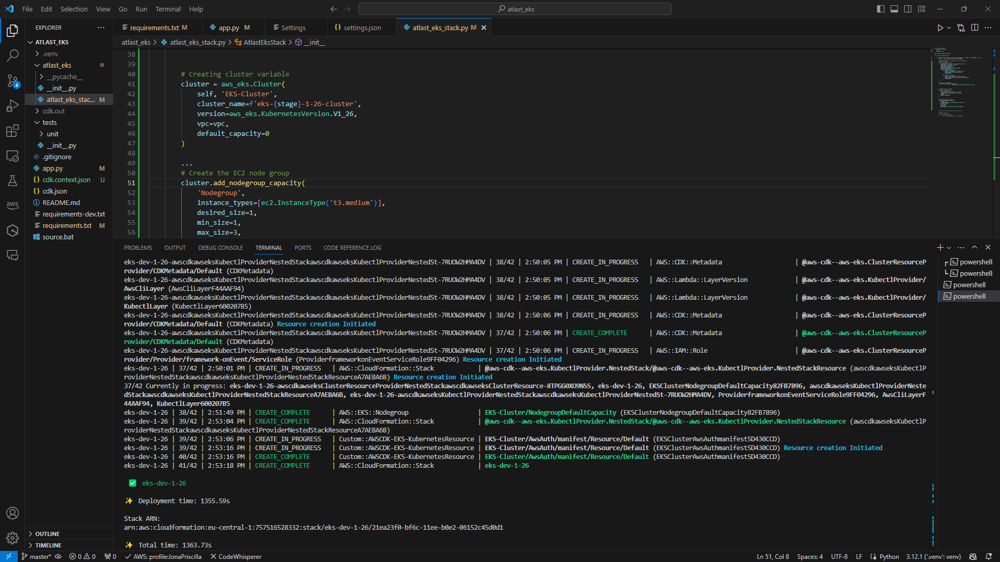

# Welcome to your CDK Python project!

This is a EKS Cluster project for CDK development with Python.

## Project requirements
**Prerequisites**

* AWS CLI
* Node.js
* Python
* IDE for programming language (VS Code)


To add additional dependencies, for example other CDK libraries, just add
them to your `setup.py` file and rerun the `pip install -r requirements.txt`
command.

## Useful commands

 * `cdk ls`          list all stacks in the app
 * `cdk synth`       emits the synthesized CloudFormation template
 * `cdk deploy`      deploy this stack to your default AWS account/region
 * `cdk diff`        compare deployed stack with current state
 * `cdk docs`        open CDK documentation

Enjoy!

'''
## AWS CDK WORKFLOW
 
* Write a code in Python
* Which is routed to the CDK backend on NodeJS
* Generates CloudFormation Template and ChangeSets
* The CDK creates a bundle of Lambda functions for its work
* And only then resources are created


The `cdk.json` file tells the CDK Toolkit how to execute your app.

This project is set up like a standard Python project.  The initialization
process also creates a virtualenv within this project, stored under the `.venv`
directory.  To create the virtualenv it assumes that there is a `python3`
(or `python` for Windows) executable in your path with access to the `venv`
package. If for any reason the automatic creation of the virtualenv fails,
you can create the virtualenv manually.

To manually create a virtualenv on MacOS and Linux:

```
$ python -m venv .venv
```

After the init process completes and the virtualenv is created, you can use the following
step to activate your virtualenv.

```
$ source .venv/bin/activate
```

If you are a Windows platform, you would activate the virtualenv like this:

```
% .venv\Scripts\activate.bat
```

**Install AWS CDK and Dependencies:**
 
 *Install AWS CDK using pip
```
% .pip install aws-cdk.core aws-cdk.aws-eks
```
 *Install AWS CDDK CLI Globally
```
% .npm install -g aws-cdk
```

Initialize a new AWS CDK project
```
%  .cdk int app --language python
```

After the above mentioned Installations a Folder would be created
```
.
├── README.md
├── app.py
├── atlast_eks
│   ├── __init__.py
│   └── atlast_eks_stack.py
├── cdk.json
├── requirements-dev.txt
├── requirements.txt
├── source.bat
└── tests
    ├── __init__.py
    └── unit
        ├── __init__.py
        └── test_atlast_eks_stack.py

4 directories, 11 files
```

Once the virtualenv is activated and the Python folder is created, you can install the required dependencies.

```
$ pip install -r requirements.txt
```

To Check that everything works:
```
$ cdk list
```
It should show you the Stack name example:
```
$ cdk list
AtlastEksStack
```
**We now have the following content of the app.py**


**In the atlast_eks/atlas_eks_stack.py we have a template to create a stack:**

```
$from aws_cdk import (
    # Duration,
    Stack,
    # aws_sqs as sqs,
)
from constructs import Construct

class AtlastEksStack(Stack):

    def __init__(self, scope: Construct, construct_id: str, **kwargs) -> None:
        super().__init__(scope, construct_id, **kwargs)

        # The code that defines your stack goes here

        # example resource
        # queue = sqs.Queue(
        #     self, "AtlastEksQueue",
        #     visibility_timeout=Duration.seconds(300),
        # )
```
Now add environment variables to the app.py– AWS account, AWS region, and update the call AtlastEksStack() to use them

**app.py:**
```
AWS_ACCOUNT = os.environ["AWS_ACCOUNT"]
AWS_REGION = os.environ["AWS_REGION"]

app = cdk.App()
AtlastEksStack(app, "AtlastEksStack",
        env=cdk.Environment(account=AWS_ACCOUNT, region=AWS_REGION),
    )
```
Setting the Environment variable in the powershell console:

```
$env:AWS_ACCOUNT = "757*****332"
$env:AWS_REGION = "eu-central-1"
```
To Check if the variables are set:

```
echo $env:AWS_ACCOUNT
echo $env:AWS_REGION
```
**Now let's create VPC and Subnets**

Using the 

CDK VPC documentation – https://docs.aws.amazon.com/cdk/api/v2/python/aws_cdk.aws_ec2/Vpc.html.

Subnet docs – https://docs.aws.amazon.com/cdk/api/v2/python/aws_cdk.aws_ec2/SubnetType.html

Adding a dictionary availability_zones with zones and describe a subnet group, one Public and one Private, and CDK will create a subnet of each type in each Availability Zone.

https://docs.aws.amazon.com/cdk/api/v2/python/aws_cdk.aws_ec2/SubnetConfiguration.html

**Creating an EKS cluster**

Update the atlast_eks_stack.py file set the version as:
```
version=eks.KubernetesVersion.V1_26
```

Add the vpc parameter to the eks.Cluster(). Hence EKS cluster code block would be:
```
 cluster = eks.Cluster(
            self, 'EKS-Cluster',
            cluster_name='eks-cluster',
            version=eks.KubernetesVersion.V1_26,
            vpc=vpc
        )
```

*At this point you can now synthesize the CloudFormation template for this code.*

```
$ cdk synth
```
Cloudformation template would look something like this example:

```
$ cdk synth

    Type: Custom::AWSCDK-EKS-Cluster
    Properties:
      ServiceToken:
        Fn::GetAtt:
          - awscdkawseksClusterResourceProviderNestedStackawscdkawseksClusterResourceProviderNestedStackResource9827C454
          - Outputs.AtlastEksStackawscdkawseksClusterResourceProviderframeworkonEvent588F9666Arn
      Config:
        name: eks-cluster
...
```
*Now all you got to do is deploy your Stack which has the code for VPC and EKS Cluster*
```
$ cdk deploy
```


Now let's check the AWS Console for the creation of Cloudformationstack, EKS cluster and VPC and its components.

The Cloudformation Stack


EKS Cluster creation


Cluster IAM role ARN


Cluster Network


Cluster VPC Map


**Now that we created a simple EKS cluster Let's create update the code by adding a NodeGroup**

Managed NodeGroup using: https://docs.aws.amazon.com/cdk/api/v1/python/aws_cdk.aws_eks/README.html#managed-node-groups

Adding the AmazonLinux AMI to the Cluster nodegroup
```
# Create the EC2 node group
        nodegroup = cluster.add_nodegroup_capacity(
            'Nodegroup',
            instance_types=[ec2.InstanceType('t3.medium')],
            desired_size=1,
            min_size=1,
            max_size=3,
            ami_type=eks.NodegroupAmiType.AL2_X86_64
        )
```

**Adding IAM Role and aws-auth ConfigMap**

Eventhough the CDK itself creates VPCs and subnets and everything else for the network and IAM roles.
we are trying to create or own IAM policy and role.

 *creating an IAM role that can be to gain access to the cluster.*

Read through AsumeRole to know more about it 
 https://docs.aws.amazon.com/STS/latest/APIReference/API_AssumeRole.html

 **Using the Docs:**

 https://docs.aws.amazon.com/cdk/api/v1/python/aws_cdk.aws_iam/Role.html

and

 https://docs-aws-amazon-com.translate.goog/cdk/api/v1/python/aws_cdk.aws_eks/AwsAuth.html?_x_tr_sl=uk&_x_tr_tl=en&_x_tr_hl=en&_x_tr_pto=wapp#aws_cdk.aws_eks.AwsAuth.add_masters_role\

 ```
 # Create an IAM Role to be assumed by admins
        masters_role = iam.Role(
            self,
            'EksMastersRole',
            assumed_by=iam.AccountRootPrincipal('*') # Allow any AWS account to assume the role
            
        )
```
*If you want only 1 account to have access take away the * in AccountRootPriniciple*

 ```
 # Attach an IAM Policy to that Role so users can access the Cluster
        masters_role_policy = iam.PolicyStatement(
            actions=['eks:DescribeCluster'],
            resources=['*'],  # Adjust the resource ARN if needed
        )
        masters_role.add_to_policy(masters_role_policy)
        cluster.aws_auth.add_masters_role(masters_role)

```
Now adding the users to Cluster's admins list. The below snippet allows any AWS user to access the cluster 

```
# Add the user to the cluster's admins
        admin_user = aws_iam.User.from_user_arn(self, "AdminUser")
        cluster.aws_auth.add_user_mapping(admin_user, groups=["system:masters"])
```
*If you want to mention only 1 account to have access the code would be*

```
# Adding a particular user to the cluster's admins
     admin_user = iam.User.from_user_arn(self, "AdminUser", user_arn="arn:aws:iam::492***148:user/arseny")
     
     ...
```
After all the required changes and updates made in the code you can deploy your stack again for it to be reflected in the already created stack in Cloudformation in your console. 

```
$ cdk deploy
```

**Fingers crossed it should get deployed! :)**